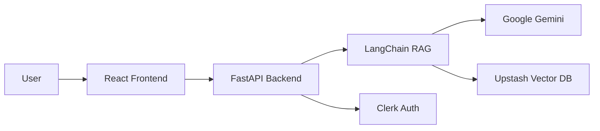

<div align="center">

# 📚 Doctype.io

### AI-Powered Document Intelligence Platform

[](https://fastapi.tiangolo.com/)
[](https://reactjs.org/)
[](https://www.typescriptlang.org/)
[](https://ai.google.dev/)

**Transform your documents into conversations.** Upload PDFs and get instant, accurate answers powered by advanced RAG technology.

[Features](#-features) • [Quick Start](#-quick-start) • [Demo](#-usage) • [API Docs](#-api-documentation) • [Contributing](#-contributing)

</div>

-----

## ✨ Features

<table>
<tr>
<td width="50%">

### 🎯 Core Capabilities

- **📄 Smart PDF Processing** - Upload and parse documents instantly
- **🤖 AI-Powered Q&A** - Natural language queries with context-aware responses
- **🧠 RAG Architecture** - Retrieval-Augmented Generation for accurate answers
- **💾 Vector Storage** - Efficient document embeddings with Upstash

</td>
<td width="50%">

### 🔧 Technical Features

- **🔐 Secure Authentication** - Powered by Clerk
- **⚡ Real-time Processing** - Fast document ingestion and retrieval
- **📊 Interactive API Docs** - Built-in Swagger UI
- **🎨 Modern UI** - Smooth animations with Framer Motion

</td>
</tr>
</table>

-----

## 🏗️ Architecture



-----

## 🛠️ Tech Stack

<details open>
<summary><b>Backend Technologies</b></summary>

|Technology                                                                                     |Purpose                       |
|-----------------------------------------------------------------------------------------------|------------------------------|
||High-performance API framework|
|                         |RAG orchestration & chains    |
||Embeddings & chat completions |
|                             |Serverless vector database    |
|                                 |PDF parsing & extraction      |

</details>

<details open>
<summary><b>Frontend Technologies</b></summary>

|Technology                                                                                              |Purpose                         |
|--------------------------------------------------------------------------------------------------------|--------------------------------|
|               |UI framework                    |
||Type-safe development           |
|  |Utility-first CSS               |
|     |Animation library               |
|                                          |Authentication & user management|

</details>

-----

## 🚀 Quick Start

### Prerequisites

- Python 3.8+
- Node.js 16+
- npm or yarn

### ⚙️ Backend Setup

```bash
# Navigate to backend directory
cd backend

# Create and activate virtual environment
python -m venv venv
source venv/bin/activate  # Windows: venv\Scripts\activate

# Install dependencies
pip install -r requirements.txt

# Configure environment variables
cp .env.example .env
# Edit .env with your API keys (see Environment Variables section)

# Start the server
uvicorn app.main:app --reload
```

🌐 Backend runs on: `http://127.0.0.1:8000`

### 🎨 Frontend Setup

```bash
# Navigate to frontend directory
cd frontend

# Install dependencies
npm install

# Configure environment variables
cp .env.example .env
# Edit .env with your Clerk key

# Start development server
npm start
```

🌐 Frontend runs on: `http://localhost:3000`

-----

## 🔑 Environment Variables

<details>
<summary><b>Backend Configuration (.env)</b></summary>

```bash
# Google AI
GOOGLE_API_KEY=your_google_api_key_here

# Upstash Vector Database
UPSTASH_VECTOR_REST_URL=your_upstash_url_here
UPSTASH_VECTOR_REST_TOKEN=your_upstash_token_here

# Clerk Authentication
CLERK_SECRET_KEY=your_clerk_secret_key_here

# CORS
FRONTEND_URL=http://localhost:3000
```

**🔗 Get Your API Keys:**

- [Google AI Studio](https://makersuite.google.com/app/apikey) - For Gemini API access
- [Upstash Console](https://console.upstash.com/) - For vector database
- [Clerk Dashboard](https://dashboard.clerk.com/) - For authentication

</details>

<details>
<summary><b>Frontend Configuration (.env)</b></summary>

```bash
# API Configuration
REACT_APP_API_URL=http://127.0.0.1:8000

# Clerk Authentication
REACT_APP_CLERK_PUBLISHABLE_KEY=your_clerk_publishable_key_here
```

</details>

-----

## 🎯 Usage

1. **🔐 Sign In** - Authenticate using Clerk
1. **📤 Upload PDF** - Drop your document or click to upload
1. **💬 Ask Questions** - Type your questions in natural language
1. **✨ Get Answers** - Receive AI-powered responses with context

-----

## 📡 API Documentation

Interactive API documentation is automatically generated and available at:

**🔗 Swagger UI:** `http://127.0.0.1:8000/docs`

### Main Endpoints

|Method|Endpoint |Description                          |
|------|---------|-------------------------------------|
|`GET` |`/`      |Health check & API status            |
|`POST`|`/ingest`|Upload and process PDF documents     |
|`POST`|`/chat`  |Query documents with natural language|

### Example Request

```bash
curl -X POST "http://127.0.0.1:8000/chat" \
  -H "Content-Type: application/json" \
  -d '{
    "question": "What is the main topic of this document?",
    "session_id": "user123"
  }'
```

-----

## ⚠️ Rate Limits

Google’s free tier includes the following limits:

|Limit Type         |Value|
|-------------------|-----|
|Daily Requests     |1,500|
|Requests per Minute|15   |

The system includes built-in rate limiting and automatic retry logic to handle these limits gracefully.

-----

## 🗺️ Roadmap

- [ ] Support for multiple document formats (DOCX, TXT, etc.)
- [ ] Multi-document querying
- [ ] Export conversation history
- [ ] Custom AI model selection
- [ ] Advanced search filters
- [ ] Document summarization
- [ ] Mobile app

-----

## 🤝 Contributing

Contributions are what make the open-source community amazing! Any contributions you make are **greatly appreciated**.

1. Fork the Project
1. Create your Feature Branch (`git checkout -b feature/AmazingFeature`)
1. Commit your Changes (`git commit -m 'Add some AmazingFeature'`)
1. Push to the Branch (`git push origin feature/AmazingFeature`)
1. Open a Pull Request

-----

## 📄 License

Distributed under the MIT License. See `LICENSE` for more information.

-----

## 🙏 Acknowledgments

Special thanks to these amazing technologies:

- [Google Generative AI](https://ai.google.dev/) - Powerful embeddings and chat models
- [Upstash](https://upstash.com/) - Serverless vector database
- [LangChain](https://www.langchain.com/) - RAG framework and orchestration
- [Clerk](https://clerk.com/) - User authentication and management
- [FastAPI](https://fastapi.tiangolo.com/) - Modern Python web framework
- [React](https://reactjs.org/) - Frontend library

-----

<div align="center">

**⭐ Star this repo if you find it helpful!**

Made with ❤️ by noturbob

[Report Bug](https://github.com/noturbob/doctype.io/issues) • [Request Feature](https://github.com/noturbob/doctype.io/issues)

</div>