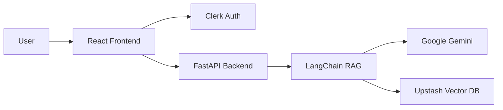

<div align="center">

# 📚 Doctype.io

### AI-Powered Document Intelligence Platform

[](https://fastapi.tiangolo.com/)
[](https://reactjs.org/)
[](https://www.typescriptlang.org/)
[](https://ai.google.dev/)

**Transform your documents into conversations.** Upload PDFs and get instant, accurate answers powered by advanced RAG technology.

[Live Demo](https://doctype-io.vercel.app) • [Features](#-features) • [Quick Start](#-quick-start) • [API Docs](#-api-documentation) • [Deployment](#-deployment) • [Contributing](#-contributing)

</div>

-----

## ✨ Features

<table>
<tr>
<td width="50%">

### 🎯 Core Capabilities

- **📄 Smart PDF Processing** - Upload and parse documents instantly
- **🤖 AI-Powered Q&A** - Natural language queries with context-aware responses
- **🧠 RAG Architecture** - Retrieval-Augmented Generation for accurate answers
- **💾 Vector Storage** - Efficient document embeddings with Upstash

</td>
<td width="50%">

### 🔧 Technical Features

- **🔐 Sign-in with Clerk** - User accounts out of the box
- **🔁 Rate-Limit Aware** - Automatic retries with backoff on the Gemini free tier
- **📊 Interactive API Docs** - Built-in Swagger UI
- **🎨 Modern UI** - Smooth animations with Framer Motion

</td>
</tr>
</table>

-----

## 🏗️ Architecture


```mermaid
graph LR
    A[User] --> B[React Frontend]
    B --> G[Clerk Auth]
    B --> C[FastAPI Backend]
    C --> D[LangChain RAG]
    D --> E[Google Gemini]
    D --> F[Upstash Vector DB]
```

**Under the hood:**

1. **Ingest** (`POST /ingest`): PyPDF extracts the text, which is split into 1000-character chunks with 200 characters of overlap. Each chunk is embedded with `text-embedding-004` and stored in Upstash Vector.
2. **Chat** (`POST /chat`): the question is embedded, the 3 most similar chunks are retrieved, and `gemini-2.5-flash` answers using them as context.

<details>
<summary><b>Project structure</b></summary>

```
doctype.io/
├── .env.example              # Backend env template
├── backend/
│   ├── requirements.txt
│   ├── render.yaml           # Render deploy config
│   └── app/
│       ├── main.py           # FastAPI app, routes, CORS
│       ├── config.py         # Settings loaded from .env
│       ├── models/schemas.py # Request/response models
│       └── services/
│           ├── pdf_loader.py   # Load + split PDFs
│           ├── vector_store.py # Embeddings + Upstash (with rate-limit retries)
│           └── rag_chain.py    # Prompt + retrieval chain
└── frontend/
    ├── .env.example          # Frontend env template
    └── src/App.tsx           # Upload + chat UI
```

</details>

-----

## 🛠️ Tech Stack

<details open>
<summary><b>Backend Technologies</b></summary>

|Technology                                                                                     |Purpose                       |
|-----------------------------------------------------------------------------------------------|------------------------------|
||High-performance API framework|
|                         |RAG orchestration & chains    |
||Embeddings & chat completions |
|                             |Serverless vector database    |
|                                 |PDF parsing & extraction      |

</details>

<details open>
<summary><b>Frontend Technologies</b></summary>

|Technology                                                                                              |Purpose                         |
|--------------------------------------------------------------------------------------------------------|--------------------------------|
|               |UI framework                    |
||Type-safe development           |
|  |Utility-first CSS               |
|     |Animation library               |
|                                          |Authentication & user management|

</details>

-----

## 🚀 Quick Start

### Prerequisites

- Python 3.9+
- Node.js 18+ and npm
- A [Google AI Studio](https://aistudio.google.com/apikey) API key
- A [Clerk](https://dashboard.clerk.com/) application
- An [Upstash Vector](https://console.upstash.com/vector) index created with **dimensions `768`** and **metric `COSINE`**. These must match the `text-embedding-004` model, or ingestion will fail.

### ⚙️ Backend Setup

```bash
# Navigate to backend directory
cd backend

# Create and activate virtual environment
python -m venv venv
source venv/bin/activate  # Windows: venv\Scripts\activate

# Install dependencies
pip install -r requirements.txt

# Configure environment variables (the template lives in the repo root)
cp ../.env.example .env
# Edit .env with your API keys (see Environment Variables section)

# Start the server
uvicorn app.main:app --reload
```

🌐 Backend runs on: `http://127.0.0.1:8000`

### 🎨 Frontend Setup

```bash
# Navigate to frontend directory
cd frontend

# Install dependencies
npm install

# Configure environment variables
cp .env.example .env
# Edit .env with your Clerk key

# Start development server
npm start
```

🌐 Frontend runs on: `http://localhost:3000`

-----

## 🔑 Environment Variables

<details>
<summary><b>Backend Configuration (backend/.env)</b></summary>

|Variable                   |Required|Description                                                     |
|---------------------------|--------|----------------------------------------------------------------|
|`GOOGLE_API_KEY`           |Yes     |Gemini API key, used for embeddings and answers                 |
|`UPSTASH_VECTOR_REST_URL`  |Yes     |Upstash Vector index REST URL                                   |
|`UPSTASH_VECTOR_REST_TOKEN`|Yes     |Upstash Vector index token                                      |
|`CLERK_SECRET_KEY`         |No      |Clerk secret key (not used yet, see Known Limitations)|
|`FRONTEND_URL`             |No      |Extra origin allowed by CORS. Default: `http://localhost:3000`  |

</details>

<details>
<summary><b>Frontend Configuration (frontend/.env)</b></summary>

|Variable                         |Required|Description                                     |
|---------------------------------|--------|------------------------------------------------|
|`REACT_APP_CLERK_PUBLISHABLE_KEY`|Yes     |Clerk publishable key                           |
|`REACT_APP_API_URL`              |No      |Backend URL. Default: `http://127.0.0.1:8000`   |

</details>

-----

## 🎯 Usage

1. **🔐 Sign In** - Authenticate using Clerk
1. **📤 Upload PDF** - Drop your document or click to upload
1. **💬 Ask Questions** - Type your questions in natural language
1. **✨ Get Answers** - Receive AI-powered responses with context

-----

## 📡 API Documentation

Interactive API documentation is automatically generated and available at:

**🔗 Swagger UI:** `http://127.0.0.1:8000/docs`

### Main Endpoints

|Method|Endpoint |Body                                     |Response                                      |
|------|---------|-----------------------------------------|----------------------------------------------|
|`GET` |`/`      |none                                     |`{ "status": "Doctype.io is running 🚀" }`     |
|`POST`|`/ingest`|`multipart/form-data`, field `file` (PDF)|`{ "filename", "chunks_processed", "status" }`|
|`POST`|`/chat`  |`{ "question": "..." }`                  |`{ "answer", "sources": [] }`                 |

Both `POST` endpoints accept an `Authorization: Bearer <clerk token>` header.

### Example Requests

```bash
# Upload a document
curl -X POST "http://127.0.0.1:8000/ingest" \
  -F "file=@document.pdf"

# Ask a question
curl -X POST "http://127.0.0.1:8000/chat" \
  -H "Content-Type: application/json" \
  -d '{"question": "What is the main topic of this document?"}'
```

-----

## 🌍 Deployment

- **Backend (Render):** create a Web Service with root directory `backend`, build command `pip install -r requirements.txt`, and start command `uvicorn app.main:app --host 0.0.0.0 --port $PORT`. Add the backend env vars, and set `FRONTEND_URL` to your frontend's URL.
- **Frontend (Vercel):** import the repo with root directory `frontend`, and set `REACT_APP_API_URL` to your Render URL.

To allow another frontend domain, set `FRONTEND_URL` or add it to `origins` in `backend/app/main.py`.

-----

## ⚠️ Known Limitations

- **Tokens aren't verified yet.** The backend doesn't validate the Clerk token, and it accepts requests with no token at all. Don't treat the API as protected.
- **All documents share one index.** Every upload goes into the same Upstash index, so `/chat` searches everything ever ingested, across all users and files. To start fresh, clear the index from the Upstash console.
- **Ingestion is slow on purpose.** To stay within Gemini's free-tier limits, chunks are embedded one at a time with a 3-second pause between them, and rate-limit errors are retried with backoff (5s, 10s, 20s). A 20-page PDF can take several minutes.
- **`sources` is always empty.** Answers don't cite their source chunks yet.

-----

## 🗺️ Roadmap

- [ ] Verify Clerk tokens on the backend
- [ ] Per-user document isolation
- [ ] Source citations in answers
- [ ] Support for multiple document formats (DOCX, TXT, etc.)
- [ ] Export conversation history
- [ ] Custom AI model selection
- [ ] Document summarization
- [ ] Mobile app

-----

## 🤝 Contributing

Contributions are what make the open-source community amazing! Any contributions you make are **greatly appreciated**.

1. Fork the Project
1. Create your Feature Branch (`git checkout -b feature/AmazingFeature`)
1. Commit your Changes (`git commit -m 'Add some AmazingFeature'`)
1. Push to the Branch (`git push origin feature/AmazingFeature`)
1. Open a Pull Request

-----

## 📄 License

Distributed under the MIT License.

-----

## 🙏 Acknowledgments

Special thanks to these amazing technologies:

- [Google Generative AI](https://ai.google.dev/) - Powerful embeddings and chat models
- [Upstash](https://upstash.com/) - Serverless vector database
- [LangChain](https://www.langchain.com/) - RAG framework and orchestration
- [Clerk](https://clerk.com/) - User authentication and management
- [FastAPI](https://fastapi.tiangolo.com/) - Modern Python web framework
- [React](https://reactjs.org/) - Frontend library

-----

<div align="center">

**⭐ Star this repo if you find it helpful!**

Made with ❤️ by noturbob

[Report Bug](https://github.com/noturbob/doctype.io/issues) • [Request Feature](https://github.com/noturbob/doctype.io/issues)

</div>
